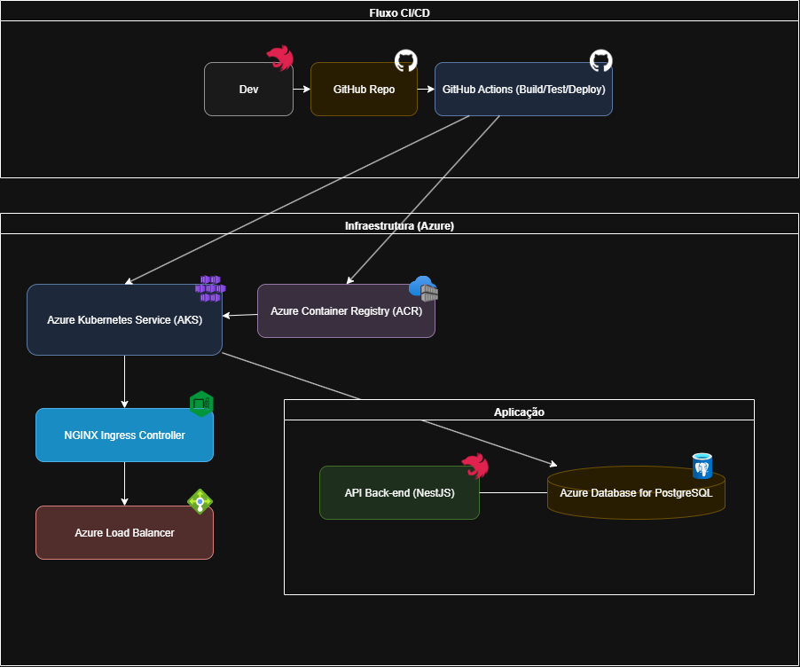

# 🛠️ Sistema Integrado de Atendimento e Execução de Serviços - Oficina Mecânica FullStack Motors

## 📌 Contexto

<<<<<<< HEAD
Uma oficina mecânica de médio porte, especializada em manutenção de veículos, tem enfrentado desafios para expandir seus serviços com qualidade e eficiência. Atualmente, o processo de atendimento, diagnóstico, execução de serviços e entrega dos veículos é feito de forma desorganizada, utilizando anotações manuais e planilhas, gerando problemas de organização, controle e comunicação com o cliente.

## 🎯 Objetivo do Projeto

Desenvolver a **primeira versão (MVP)** do back-end do sistema, com foco em criar uma base robusta para a gestão de ordens de serviço, clientes e peças. O projeto visa aplicar conceitos de arquitetura em nuvem, automação de infraestrutura e CI/CD para garantir uma solução escalável, segura e de fácil manutenção.

Os objetivos desta fase são:
- **Modelagem do Domínio:** Aplicar os princípios do Domain-Driven Design (DDD) para estruturar o núcleo da aplicação.
- **Desenvolvimento da API:** Construir os endpoints necessários para as funcionalidades de CRUD e gestão de OS.
- **Infraestrutura como Código (IaC):** Utilizar o Terraform para provisionar a infraestrutura necessária na nuvem de forma automatizada.
- **Contêineres e Orquestração:** Empacotar a aplicação com Docker e realizar o deploy em um cluster Kubernetes (AKS).
- **Automação de Deploy (CI/CD):** Criar um fluxo de integração e entrega contínua com GitHub Actions.

---

## 🏛️ Arquitetura da Solução

A arquitetura foi projetada para ser escalável, resiliente e segura, utilizando serviços gerenciados em nuvem para otimizar a operação e manutenção.



### Componentes da Aplicação
* **API Back-end (NestJS):** Aplicação principal que contém toda a lógica de negócio, seguindo os padrões do DDD.
* **Banco de Dados (PostgreSQL):** Banco de dados relacional para persistência dos dados da aplicação.

### Infraestrutura Provisionada (Azure)
* **Azure Kubernetes Service (AKS):** Cluster gerenciado para orquestrar os contêineres da aplicação, garantindo escalabilidade e alta disponibilidade.
* **Azure Container Registry (ACR):** Repositório privado para armazenar as imagens Docker da aplicação.
* **Azure Load Balancer:** Provisionado automaticamente pelo AKS para expor o Ingress Controller à internet e distribuir o tráfego.

### Fluxo de Deploy (CI/CD)
O processo de deploy é totalmente automatizado utilizando GitHub Actions:
1.  **Push no Repositório:** O desenvolvedor envia o código para a branch principal no GitHub.
2.  **GitHub Actions (CI):** A action é acionada, realizando o build da aplicação, execução de testes e a construção da imagem Docker.
3.  **Push da Imagem:** A imagem Docker é enviada para o Azure Container Registry (ACR).
4.  **Deploy no AKS (CD):** A action se conecta ao cluster AKS e aplica os manifestos Kubernetes (`deployment.yaml`, `service.yaml`, etc.), atualizando a aplicação para a nova versão.
=======
Uma oficina mecânica de médio porte, especializada em manutenção de veículos, tem enfrentado desafios para expandir seus serviços com qualidade e eficiência.

Atualmente, o processo de atendimento, diagnóstico, execução de serviços e entrega dos veículos é feito de forma **desorganizada**, utilizando anotações manuais e planilhas, gerando problemas como:

- ❌ Erros na priorização dos atendimentos
- ❌ Falhas no controle de peças e insumos
- ❌ Dificuldade em acompanhar o status dos serviços
- ❌ Perda de histórico de clientes e veículos
- ❌ Ineficiência no fluxo de orçamentos e autorizações

Para resolver essas questões, a oficina decidiu investir em um **Sistema Integrado de Atendimento e Execução de Serviços**, permitindo:

- 📲 Clientes acompanharem em tempo real o andamento dos serviços
- ✅ Aprovação de reparos adicionais via aplicativo
- ⚙️ Gestão interna mais eficiente, organizada e segura

---

## 🎯 Objetivo do Projeto

Desenvolver a **primeira versão (MVP)** do back-end do sistema, com foco em:

- Gestão de **ordens de serviço (OS)**
- Gestão de **clientes**
- Gestão de **peças e insumos**
- Aplicação de **Domain-Driven Design (DDD)**
- Garantia de **boas práticas de Qualidade de Software e Segurança**

---

## 🚀 Funcionalidades

### 📄 Criação da Ordem de Serviço (OS)

- Identificação do cliente por **CPF/CNPJ**
- Cadastro de veículo (**placa, marca, modelo, ano**)
- Inclusão dos serviços solicitados (ex.: troca de óleo, alinhamento)
- Inclusão de peças e insumos necessários
- Geração automática de orçamento com base nos serviços e peças
- Envio do orçamento ao cliente para aprovação

### 📊 Acompanhamento da OS

- Status possíveis:
  - Recebida
  - Em diagnóstico
  - Aguardando aprovação
  - Em execução
  - Finalizada
  - Entregue
- Alteração automática de status conforme ações no sistema
- Consulta pública via API para acompanhamento do progresso

### 🗂️ Gestão Administrativa

- CRUD de clientes
- CRUD de veículos
- CRUD de serviços
- CRUD de peças e insumos, com controle de estoque
- Listagem e detalhamento de ordens de serviço
- Monitoramento do tempo médio de execução

---

## 🔐 Segurança e Qualidade

- Autenticação **JWT** para APIs administrativas
- Validação de dados sensíveis (**CPF, CNPJ, placa de veículo**)
- Testes unitários e de integração para os principais fluxos
>>>>>>> 5b66bfbbd308702025668032bb574e2a2ea33638

---

## 🏗️ Tecnologias Utilizadas

<<<<<<< HEAD
- **Back-end:** Node.js / NestJS com TypeScript
- **Banco de Dados:** PostgreSQL
- **Arquitetura de Código:** DDD (Domain-Driven Design)
- **Testes:** Jest
- **Segurança:** JWT (JSON Web Token)
- **Infraestrutura:** Docker, Kubernetes (AKS), Terraform
- **CI/CD:** GitHub Actions

---

## 🚀 Execução e Deploy

### 1. Execução Local com Docker
Siga os passos abaixo para executar a aplicação e o banco de dados localmente.

**Pré-requisitos:**
- [Docker](https://www.docker.com/) e [Docker Compose](https://docs.docker.com/compose/) instalados.

**Passos:**
1.  Clone o repositório:
    ```bash
    git clone [https://github.com/ViniciusMarinheiro/P-s-Tech-12SOAT---Tech-Challenge.git](https://github.com/ViniciusMarinheiro/P-s-Tech-12SOAT---Tech-Challenge.git)
    ```
2.  Acesse a pasta do projeto:
    ```bash
    cd P-s-Tech-12SOAT---Tech-Challenge
    ```
3.  Construa e inicie os containers:
    ```bash
    docker-compose up -d --build
    ```
4.  A aplicação estará disponível em `http://localhost:3333`.

### 2. Provisionamento da Infraestrutura com Terraform
Os arquivos do Terraform estão localizados na pasta `/terraform` e são responsáveis por criar o cluster AKS e os recursos necessários no Azure.

**Pré-requisitos:**
- [Terraform](https://www.terraform.io/downloads.html) instalado.
- [Azure CLI](https://docs.microsoft.com/en-us/cli/azure/install-azure-cli) instalado e autenticado na sua conta (`az login`).

**Passos:**
1.  Acesse a pasta do Terraform:
    ```bash
    cd terraform
    ```
2.  Inicialize o Terraform:
    ```bash
    terraform init
    ```
3.  Gere um plano de execução para revisar os recursos que serão criados:
    ```bash
    terraform plan
    ```
4.  Aplique o plano para provisionar a infraestrutura:
    ```bash
    terraform apply
    ```

### 3. Deploy no Kubernetes (AKS)
Os manifestos para o deploy no Kubernetes estão na pasta `/k8s`.

**Pré-requisitos:**
- `kubectl` instalado.
- Acesso ao cluster AKS configurado no seu `kubectl`.

**Passos:**
1.  Aplique os manifestos de configuração e segredos (se houver):
    ```bash
    kubectl apply -f k8s/configmap.yaml
    kubectl apply -f k8s/secrets.yaml
    ```
2.  Aplique o manifesto do Ingress Controller (ex: NGINX):
    ```bash
    kubectl apply -f [https://raw.githubusercontent.com/kubernetes/ingress-nginx/controller-v1.8.2/deploy/static/provider/cloud/deploy.yaml](https://raw.githubusercontent.com/kubernetes/ingress-nginx/controller-v1.8.2/deploy/static/provider/cloud/deploy.yaml)
    ```
3.  Realize o deploy da aplicação:
    ```bash
    kubectl apply -f k8s/deployment.yaml
    kubectl apply -f k8s/service.yaml
    kubectl apply -f k8s/ingress.yaml
    ```
4.  Verifique o IP externo do Load Balancer para acessar a aplicação:
    ```bash
    kubectl get service -n ingress-nginx
    ```

---

## 📄 Documentação da API (Swagger / Postman)

A documentação completa dos endpoints, incluindo modelos de requisição e resposta, está disponível via Swagger.

- **Link do Swagger UI:** `http://172.212.53.149/api/v1/oficina/documentation`

- **Collection do Postman:** `[Link para a Collection Completa](SEU_LINK_AQUI)`

### Credenciais de Acesso (Swagger)
Para testar os endpoints protegidos, utilize as seguintes credenciais:
- **Login:** `adm@gmail.com`
- **Senha:** `admin123@`

---

## 🎥 Vídeo Demonstrativo

Um vídeo demonstrativo foi gravado para apresentar o ambiente em execução, o fluxo de CI/CD e o funcionamento da API.

- **[Assistir ao Vídeo no YouTube](SEU_LINK_AQUI)**

O vídeo demonstra os seguintes pontos:
- Deploy da aplicação.
- Execução do pipeline de CI/CD no GitHub Actions.
- Consumo dos principais endpoints da API (ex: criação e consulta de uma Ordem de Serviço).
- Demonstração da escalabilidade automática do Kubernetes (simulando aumento de carga).

---

<details>
  <summary><strong>⚙️ Comandos Adicionais de Desenvolvimento e Testes (Ambiente Local)</strong></summary>

  ### Descrição
  Repositório inicial para o framework [Nest](https://github.com/nestjs/nest) em TypeScript.

  ### Compilar e executar o projeto (sem Docker)
  ```bash
  # Instalar dependências
  $ yarn

  # Modo de desenvolvimento com watch
  $ yarn start:dev

  # Modo de produção
  $ yarn start:prod
=======
- **Node.js / NestJS**
- **TypeScript**
- **PostgreSQL**
- **DDD (Domain-Driven Design)**
- **Jest** (testes)
- **JWT** (segurança)

---

## 🛠️ Como Executar o Projeto com Docker Compose

### Pré-requisitos

- [Docker](https://www.docker.com/) instalado
- [Docker Compose](https://docs.docker.com/compose/) instalado

### Passos para execução

1. Clone o repositório:

   ```bash
   git clone https://github.com/ViniciusMarinheiro/P-s-Tech-12SOAT---Tech-Challenge.git

   ```

2. Acesse a pasta do projeto:
   ```bash
   cd P-s-Tech-12SOAT---Tech-Challenge
   ```
3. Construa e inicie os containers:

   ```bash
   docker-compose up -d --build

   ```

4. Acesse a aplicação na porta configurada:

   ```bash
   http://localhost:3333/api/oficina

   ```

5. Acesse a documentação da aplicação:
   ```bash
   http://localhost:3333/api/v1/oficina/documentation
   ```
   
## Login no Swagger
Conta administrativa para testes:
Login
```bash
adm@gmail.com
```
Senha
```bash
admin123@
```

## Descrição

[Nest](https://github.com/nestjs/nest) framework TypeScript starter repository.

## Compilar e executar o projeto

```bash
# development
$ yarn

# watch mode
$ yarn start:dev

# production mode
$ yarn start:prod
```

## Create Migrations

```bash
$ yarn migration:generate MinhaMigration
```

## Execução de testes

```bash
# unit tests
$yarn test

# e2e tests
$yarn test:e2e

# test coverage
$yarn test:cov
```

## Desenvolvimento

When you're ready to deploy your NestJS application to production, there are some key steps you can take to ensure it runs as efficiently as possible. Check out the [deployment documentation](https://docs.nestjs.com/deployment) for more information.

If you are looking for a cloud-based platform to deploy your NestJS application, check out [Mau](https://mau.nestjs.com), our official platform for deploying NestJS applications on AWS. Mau makes deployment straightforward and fast, requiring just a few simple steps:

```bash
$ npm install -g @nestjs/mau
$ mau deploy
```

With Mau, you can deploy your application in just a few clicks, allowing you to focus on building features rather than managing infrastructure.

## Resources

Check out a few resources that may come in handy when working with NestJS:

- Visit the [NestJS Documentation](https://docs.nestjs.com) to learn more about the framework.
- For questions and support, please visit our [Discord channel](https://discord.gg/G7Qnnhy).
- To dive deeper and get more hands-on experience, check out our official video [courses](https://courses.nestjs.com/).
- Deploy your application to AWS with the help of [NestJS Mau](https://mau.nestjs.com) in just a few clicks.
- Visualize your application graph and interact with the NestJS application in real-time using [NestJS Devtools](https://devtools.nestjs.com).
- Need help with your project (part-time to full-time)? Check out our official [enterprise support](https://enterprise.nestjs.com).
- To stay in the loop and get updates, follow us on [X](https://x.com/nestframework) and [LinkedIn](https://linkedin.com/company/nestjs).
- Looking for a job, or have a job to offer? Check out our official [Jobs board](https://jobs.nestjs.com).

## Support

Nest is an MIT-licensed open source project. It can grow thanks to the sponsors and support by the amazing backers. If you'd like to join them, please [read more here](https://docs.nestjs.com/support).

## Stay in touch

- Author - [Kamil Myśliwiec](https://twitter.com/kammysliwiec)
- Website - [https://nestjs.com](https://nestjs.com/)
- Twitter - [@nestframework](https://twitter.com/nestframework)

## License

Nest is [MIT licensed](https://github.com/nestjs/nest/blob/master/LICENSE).
>>>>>>> 5b66bfbbd308702025668032bb574e2a2ea33638
